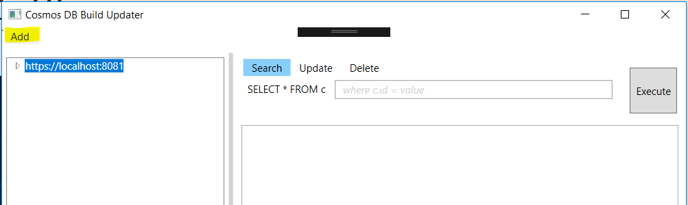

## 	CosmosDB Bulk update/delete utility

## <u>Introduction</u>

As of now there are no tools to perform CosmosDB bulk update or bulk delete based on where condition.

It is not always required to update or delete documents in CosmosDB. 

Used C# and WPF. 

## <u>Tool Usage</u>

1. Click on Add button to add new CosmosDB Account 

2. Enter endpoint address and security key to add new account.

   

3. Select respective account for update or delete operations.

4. Select Update/Delete tab to perform respective operation. Both operations work like regular sql operations. 
5. User is capable of adding more than one CosmosDB account to utility. 
6. Update/Delete operations can be performed against collection. 
7. Internally it will replace the old document with updated document in case of Update. 

